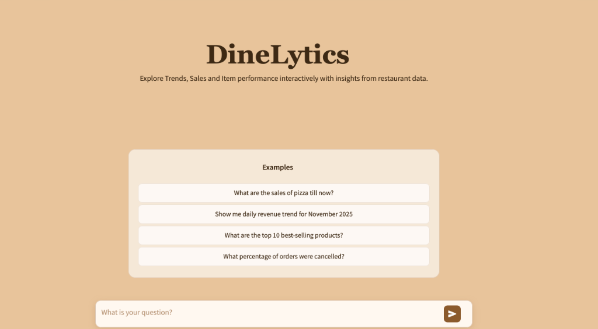

# DineLytics — Advanced Analytics Chatbot

DineLytics is a production-grade AI analytics assistant designed to democratize access to business data. It allows users to ask complex questions about restaurant operations, sales, and inventory in plain English and receive precise, tabular insights, bypassing the need for database knowledge or complex BI tools.

🔗 **Try the Live Demo Here: [DineLytics](http://dinelytics-194643721.us-east-2.elb.amazonaws.com/)**



##  Key Features

*   **Multi-Agent Orchestration**: Powered by **CrewAI**, a team of specialized agents co-operate to handle queries:
    *   **Schema Analyzer**: Intelligently maps user questions to relevant MongoDB collections and fields, handling schema variations.
    *   **Query Builder**: Constructs optimized, aggregation-ready MongoDB queries.
    *   **Data Analyst**: Executes queries, validates results, and formats them into clean, human-readable tables.
*   **Semantic Understanding**: Uses **NVIDIA Embeddings** and **Pinecone** to resolve naming inconsistencies (e.g., matching "Mac n Cheese" to "Mac & Cheese") via semantic search.
*   **Production-Ready Architecture**: Built with **Streamlit** for a responsive UI, containerized with **Docker**, and utilizing **ZenML** for data pipelines.
*   **Conversational Memory**: Maintains context across the session to support follow-up questions.
*   **Schema-Aware**: Dynamically adapts to your specific MongoDB schema structure.

##  Tech Stack

*   **Language**: Python 3.12+
*   **Frameworks & Libraries**:
    *   **CrewAI**: Multi-agent orchestration.
    *   **LangChain**: Tooling and LLM abstraction.
    *   **Streamlit**: Interactive web interface.
    *   **Pydantic**: Data validation and detailed schema definitions.
    *   **PyMongo**: Direct database interaction.
*   **AI & Data**:
    *   **LLMs**: NVIDIA NIM (Llama 3.3).
    *   **Vector DB**: Pinecone (for semantic item lookup).
    *   **Database**: MongoDB.
*   **Infrastructure**:
    *   **Docker & Docker Compose**: Containerization and orchestration.
    *   **ZenML**: MLOps pipelines for embedding generation.

##  Project Structure

```text
src/dashboard/
├── callbacks/           # UI feedback mechanisms (Streamlit placeholders)
├── config/              # Configuration files (agents.yaml, tasks.yaml)
├── memory/              # Conversation history management
├── pipelines/           # ZenML pipelines for data processing
├── schemas/             # JSON schemas for local validation
├── steps/               # Individual pipeline steps
├── tools/               # Custom tools (MongoDB connector, Python REPL, etc.)
├── ui/                  # UI components (sidebar, chat interface, CSS)
├── utils/               # Utility functions (logging, formatting)
└── conversational_chatbot.py  # Main entry point and CrewAI logic
```

##  Getting Started

### Prerequisites

*   **Docker** (Recommended) OR **Python 3.12**
*   **NVIDIA API Key**
*   **Pinecone API Key** & Index
*   **MongoDB Instance** (URI)

### Environment Setup

Create a `.env` file in the root directory:

```env
NVIDIA_API_KEY=your_nvidia_key
PINECONE_API_KEY=your_pinecone_key
mongodb_uri=your_mongodb_connection_string
database_name=your_database_name
```

### Installation & Run

#### Option A: Docker (Recommended)

1.  **Build and Start**:
    ```bash
    docker compose up --build
    ```
2.  **Access App**: Open [http://localhost:8501](http://localhost:8501) in your browser.

#### Option B: Local Python

1.  **Install Dependencies**:
    ```bash
    pip install -r requirements.txt
    pip install crewai~=0.76.9 crewai-tools~=0.13.4
    ```
2.  **Run Application**:
    ```bash
    cd src/dashboard
    streamlit run conversational_chatbot.py
    ```

##  Usage Examples

DineLytics handles a wide range of business queries. Try asking:

*   **Sales Performance**: *"What were the total sales for Pizza last month?"*
*   **Trends**: *"Show me the daily revenue trend for November 2025."*
*   **Top Performers**: *"What are the top 5 best-selling products across all stores?"*
*   **Operational**: *"Which stores had the highest delivery fees last week?"*

##  Configuration

*   **Agents**: Customize agent roles and goals in `src/dashboard/config/agents.yaml`.
*   **Tasks**: Define specific agent workflows in `src/dashboard/config/tasks.yaml`.
*   **Schemas**: Manage collection mappings in `src/dashboard/config/schema.yaml`.

---